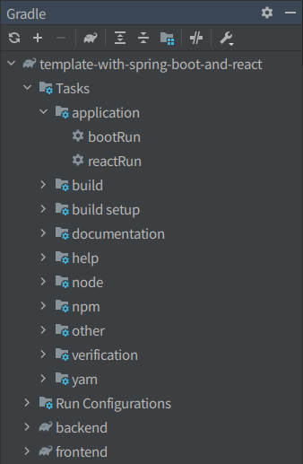

# Template with Spring Boot and React

Spring Boot와 React으로 구성된 템플릿입니다.  
이 템플릿을 사용하여 간편하게 Spring Boot와 React 조합의 웹을 만들 수 있습니다.

## 시작하기

```sh
git clone https://github.com/LeeKyuHyuk/Template-with-Spring-Boot-and-React.git ProjectName
```

1. `settings.gradle.kts` 파일에 있는 `rootProject.name`에 기본 값으로 'template-with-spring-boot-and-react'라고 적혀있을 것입니다. 기본 값을 지우고 진행하려는 프로젝트의 이름을 입력합니다.

2. `backend/build.gradle.kts` 파일에 있는 `group`과 `version`을 프로젝트에 맞게 수정합니다.

3. `frontend/package.json` 파일에 있는 `name`, `version`, `description`, `repository`, `keywords`, `author`, `license`, `bugs`, `homepage`를 프로젝트에 맞게 수정합니다.

```json
{
  "name": "프로젝트 이름",
  "version": "프로젝트 버전",
  "description": "프로젝트 설명",
  "author": "제작자 이름 또는 단체",
  "license": "프로젝트의 라이센스",
  "repository": "프로젝트의 저장소 URL",
  "keywords": ["프로젝트 키워드"],
  "bugs": "이슈 등록 페이지 URL",
  "homepage": "해당 프로젝트의 홈페이지 URL"
}
```

## Dev Server 실행하기



`application`에 있는 `bootRun`과 `reactRun` Task를 실행하여, Spring Boot와 React Dev Server를 실행하여 개발을 진행할 수 있습니다.
- **포트 번호 :** Spring Boot은 `8080`, React Dev Server는 `8081`입니다.

## JAR 파일로 배포하기

`build`에 있는 `bootJar` Task를 통하여 JAR 파일을 생성할 수 있습니다.  
`build/libs`에 `template-with-spring-boot-and-react.jar`라는 이름으로 생성됩니다.  
생성되는 JAR 파일의 이름을 바꾸고 싶다면, `backend/build.gradle.kts`의 `tasks.bootJar`에 있는 `archiveFileName.set()`과 `archiveBaseName.set()`를 수정하면 됩니다.

```gradle
tasks.bootJar {
	archiveFileName.set("template-with-spring-boot-and-react.jar")
	archiveBaseName.set("template-with-spring-boot-and-react")
	dependsOn(":frontend:buildFrontend")
	dependsOn(":frontend:copyFrontend")
	doLast {
		copy {
			from("${project.buildDir}")
			into("${project.rootDir}/build")
		}
	}
}
```
